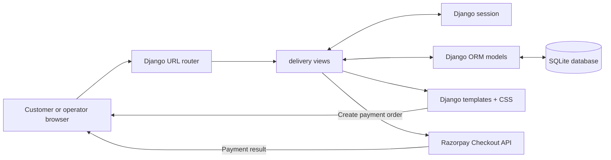
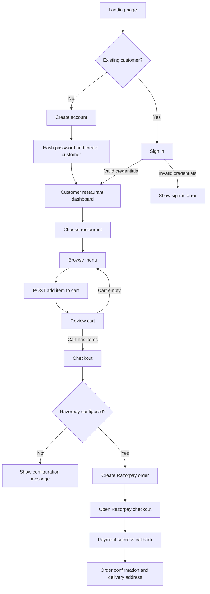
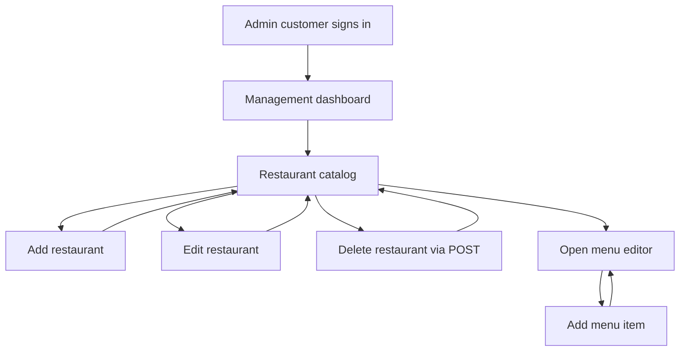
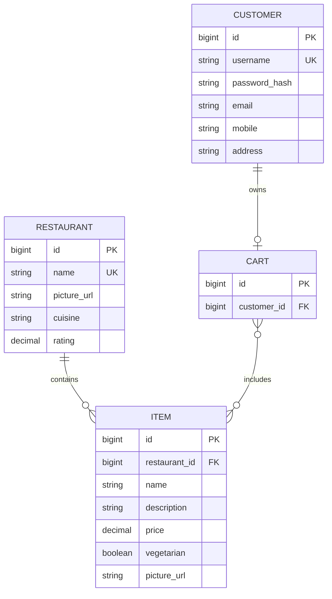

# Meal Mate

A focused Django food-ordering platform for discovering local restaurants, browsing menus, building a cart, and paying securely through Razorpay.

## Problem Statement

Small restaurants and food businesses often manage their menu, customer orders, and delivery details through disconnected tools. Customers have to move between informal menus, messages, and payment links, while operators lack one simple place to maintain restaurant listings and menu items.

Meal Mate solves this by bringing the core ordering journey into one responsive web application:

- Customers can create an account, discover restaurants, browse menus, and build an order.
- Restaurant operators can maintain restaurant details and menu items from a management dashboard.
- The application keeps cart state in one place and hands payment processing to Razorpay.
- Validation, CSRF protection, hashed passwords, and safe HTTP methods reduce common application risks.

## Goals

1. Make restaurant discovery and menu browsing quick on desktop and mobile.
2. Keep the customer journey short: sign up, choose, cart, pay.
3. Give operators simple catalog and menu management tools.
4. Keep external payment credentials out of source code.
5. Maintain a small, testable Django codebase that can grow into a production ordering system.

## Features

### Customer experience

- Account creation with validation for password, email, mobile, and address
- Password hashing with legacy plaintext-password upgrade on successful login
- Restaurant cards with cuisine and rating information
- Menu cards with descriptions, prices, images, and vegetarian labels
- Session-backed login state and cart management
- Razorpay checkout integration
- Order confirmation with delivery address

### Management experience

- Restaurant create, read, update, and delete workflow
- Menu item creation for each restaurant
- Rating and price validation
- Duplicate restaurant and menu-item protection
- CSRF-protected POST forms
- Custom management routes under `/manage/`, separate from Django Admin at `/admin/`

## System Architecture

Meal Mate follows a conventional Django request-response architecture. Django routes the request to a view, the view validates input and coordinates models, and a template renders the response. Razorpay is used only when a non-empty cart reaches checkout.



### Component responsibilities

| Component | Responsibility |
| --- | --- |
| `meal_buddy/urls.py` | Mounts Django Admin and the `delivery` application |
| `delivery/urls.py` | Defines customer, cart, checkout, and management routes |
| `delivery/views.py` | Validates requests, manages sessions, coordinates models and payment setup |
| `delivery/models.py` | Stores customers, restaurants, menu items, and carts |
| `delivery/templates/delivery/` | Renders the public, customer, management, payment, and confirmation screens |
| `delivery/static/delivery/app.css` | Provides the responsive visual system and shared components |
| SQLite | Local persistence for development |
| Razorpay | External payment-order creation and checkout UI |

## Working Graph: Customer Order Flow



## Working Graph: Management Flow



## Data Model



## Request and Route Map

| Method | Route | Purpose |
| --- | --- | --- |
| `GET` | `/` | Landing page |
| `GET` | `/signup/` | Signup form |
| `POST` | `/signup/submit/` | Create customer account |
| `GET` | `/signin/` | Sign-in form |
| `POST` | `/signin/submit/` | Authenticate customer |
| `GET` | `/customer/<username>/` | Restaurant dashboard |
| `GET` | `/restaurants/<id>/menu/<username>/` | Restaurant menu |
| `POST` | `/cart/items/<id>/<username>/add/` | Add item to cart |
| `GET` | `/cart/<username>/` | View cart |
| `GET` | `/checkout/<username>/` | Prepare payment checkout |
| `GET` | `/orders/<username>/` | Show order confirmation |
| `GET` | `/manage/dashboard/` | Management dashboard |
| `GET` | `/manage/restaurants/` | List restaurants |
| `POST` | `/manage/restaurants/new/submit/` | Add restaurant |
| `POST` | `/manage/restaurants/<id>/edit/submit/` | Update restaurant |
| `POST` | `/manage/restaurants/<id>/delete/` | Delete restaurant |
| `GET` | `/admin/` | Django's built-in admin site |

## Technology Stack

- Python 3.10+
- Django 5.2 as declared in `requirements.txt`
- SQLite for local development
- Django Templates, semantic HTML, CSS, and small vanilla JavaScript enhancements
- Razorpay Python SDK and Checkout.js
- Django's built-in sessions, messages, CSRF middleware, and password hashers

## Project Structure

```text
Meal-buddy/
├── delivery/
│   ├── migrations/
│   ├── static/delivery/app.css
│   ├── templates/delivery/
│   ├── models.py
│   ├── tests.py
│   ├── urls.py
│   └── views.py
├── meal_buddy/
│   ├── settings.py
│   ├── urls.py
│   ├── asgi.py
│   └── wsgi.py
├── db.sqlite3
├── manage.py
├── requirements.txt
└── README.md
```

## Local Setup

```bash
git clone https://github.com/sandeep-kumar-mehta/Meal-buddy.git
cd Meal-buddy
python -m venv .venv
```

Activate the virtual environment:

```powershell
# Windows PowerShell
.\.venv\Scripts\Activate.ps1
```

```bash
# macOS/Linux
source .venv/bin/activate
```

Install dependencies, migrate, and start the app:

```bash
python -m pip install -r requirements.txt
python manage.py migrate
python manage.py runserver
```

Open <http://127.0.0.1:8000/>.

## Environment Variables

Set these values outside source control for payment and production use:

```text
DJANGO_SECRET_KEY=replace-with-a-long-random-value
DJANGO_DEBUG=False
DJANGO_ALLOWED_HOSTS=example.com,www.example.com
RAZORPAY_KEY_ID=your-razorpay-key-id
RAZORPAY_KEY_SECRET=your-razorpay-key-secret
```

Without Razorpay credentials, the application intentionally shows a clear payment-configuration message instead of attempting an invalid API call.

## Validation

```bash
python manage.py check
python manage.py makemigrations --check
python manage.py test
```

The regression suite covers:

- Home, customer, menu, management, checkout, and order page rendering
- Password hashing during signup
- POST-only cart operations
- Empty-cart checkout behavior
- POST-only restaurant deletion

## Known Limitations and Next Steps

- The project uses a custom `Customer` model and a username-based session flow. Production work should migrate to Django's built-in authentication system and permission decorators.
- The current cart is a many-to-many collection without quantities. A future `CartItem` model should store quantity, price snapshots, and line totals.
- Orders are represented by the cart confirmation flow rather than a persistent order model. Add `Order` and `OrderItem` models for history, status tracking, refunds, and delivery operations.
- Payment success should be verified server-side through Razorpay signatures and webhooks before marking an order paid.
- SQLite is suitable for local development; production should use PostgreSQL or another managed relational database.

## License

This is currently a portfolio project. Add a license file before distributing it as reusable software.
